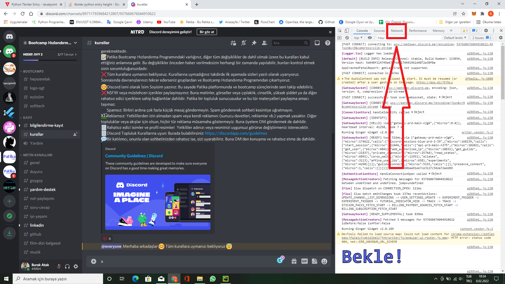
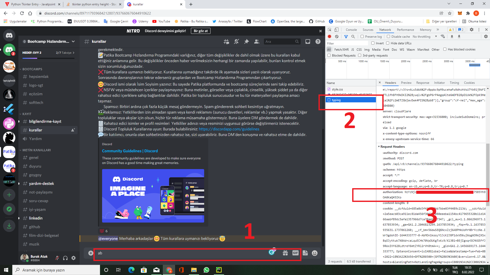

# Follow Up Program For Patika Discord Channel

This program takes user's GitHub and Linkedin profile links from Patika.dev discord channel and follows them automatically.

+++++

Bu program Patika.dev discord kanalından, kullanıcıların Linkedin ve GitHub profil linklerini alarak onları otomatik olarak takip eder.

+++++

**With [Lala Ibadullayeva's](https://github.com/Lala2398) contribution.
Thanks to [Fevzi Yuksel](https://github.com/FevziYuksel), [Cemre Dural](https://github.com/cemredural) and [Hilal Tuana Kum](https://github.com/hilallkum) for testing program before releasing.**

Not: Programı kullanıcı arayüzlü olarak indirip kullanmak için [Google Drive](https://drive.google.com/drive/folders/1EznMp7iuYbwDEdYGXGLrqfxFC27yyvw9?usp=sharing) linkine giderek "Follow Up Program" klasörünü sağ tıklayarak indir'e basın.

Program indirildikten sonra, "Follow Up Program.exe"yi çalıştırın arayüz ve chrome tarayıcısı açılacak. Programda "Get Links" yazan butonlar "Bootcamp Hızlandırma Programı Patika.dev" sunucusundaki GitHub ve Linkedin kanallarına yazılmış linkleri alarak text dosyasına kaydeder. "Start Follow" butonları ise ilgili site için kaydedilen linkleri alarak GitHub için takip eder, Linkedin için ise bağlantı kurar.

***"Start Folllow" butonlarına basmadan önce açılan tarayıcıda takip işlemini yapmak istediğiniz GitHub veya Linkedin hesabınıza giriş yapmayı unutmayın.***

Discorddaki Bootcamp Hızlandırma Programı-Patika.dev sunucusuna istek atarak gerekli linkleri alabilmek için programa "Authorization Key"inizi girmeniz gerekiyor. 
a) Bunu temin edebilmek için öncelikle discordu web tarayıcınızda açarak Bootcamp Hızlandırma Programı-Patika.dev gidip herhangi bir yere sağ tıklayarak inceleye basmanız gerekiyor. 
b) Açılan kısımda ilk resimde göreceğiniz Network kısmına tıkladıkdan sonra 2. resimde göreceğiniz üzere sunucu içerisindeki herhangi bir kanala bir şey yazmanız lazım fakat entere basıp yazdığınızı göndermenize gerek yok. 
c) Ardından resimde "2" ile gösterilen typinge 1 defa tıklayarak açılan kısımda "authorization"nın karşısında bulunan keyi kopyalayarak programdaki Entry Box'a yapıştırdıktan sonra "Get Links" butonlarını kullanıp ilgili kanallardan linkleri alabilirsiniz.

